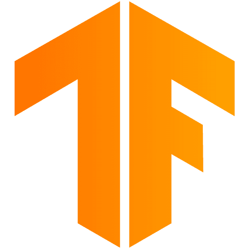

# Hi there! 🤗 I'm Faith Villarreal.

$$  \color{#99b46d}{•┈୨♡୧┈• Software\ Engineer.\ Machine\ Learning\ Scientist. •┈୨♡୧┈•} $$

### About Me 🤓👈🏽
- B.S. **Computer Science** @ **New York Univeristy**
- Minoring in **🏺Philosophy**
- Obsessed with **fashion** and **mathematics**
- Interested in a career in **machine learning**, **software development**, and **quantitative development**. 

### 💌 My Favorite Technologies

<table>
  <tr>
    <td align="center" width="96">
        
       <b>Python</b>
    </td>
    <td align="center" width="96">
        
       <b>C++</b>
    </td>
    <td align="center" width="96">
        
       <b>PyTorch</b>
    </td>
      <td align="center" width="96">
        
       <b>MongoDB</b>
    </td>
    <td align="center" width="96">
        
       <b>TypeScript</b>
    </td>
  </tr>
  <tr>
    <td align="center" width="96">
        
       <b>TensorFlow</b>
    </td>
    <td align="center" width="96">
        
       <b>Jupyter Notebook</b>
    </td>
    <td align="center" width="96">
        
       <b>Notion</b>
    </td>
  </tr>
</table>
 
  
$$ \color{#99b46d}{｡ﾟ•┈┈┈꒰ა ♡ ໒꒱┈┈┈•  ｡ﾟ}$$
  

### 🍓Current Coursework

| Subject                                | Description                                                             |
|----------------------------------------|-------------------------------------------------------------------------|
| Natural Language Processing            | Using linguistics to make conclusions about textual data.               |
| Philosophy of the Mind                 | Determining intelligence in digital computers.                          |
| Independent Study: Generative ML Models| Understanding the mathematics and mechanics behind modern models.    |

### 🍄Recent Projects
| Project                                | Description                                                             |
|----------------------------------------|-------------------------------------------------------------------------|
| 🌺 **Fashion Faerie**                 | My dream application since I was a kid. Using Pintrest, we created a personal stylist who takes inspiration from your favorite Pintrest baord and creates an outfit based on your closet. |
| 🌸 **Stable Diffusion from Scratch** | To learn exactly how the diffusion process works, I built a stable diffusion model using just TensorFlow and OpenAI's CLIP model for word embeddings. |
| 🌼 **Teddy Care** | A full stack web application to help health providers organize thier patient data and use wearble data to spot worrying trends in patient health. |
